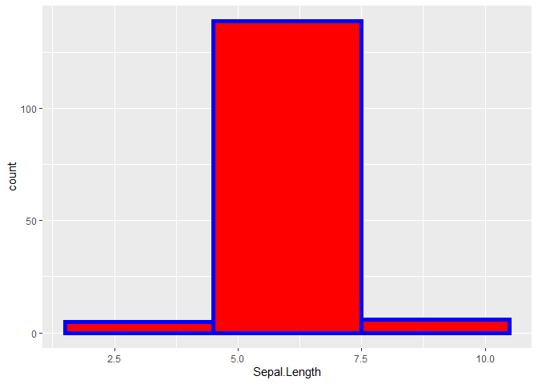

Cool Stuff in R
================

``` r
library(GGally)
ggpairs(iris, aes(colour = Species, alpha = 0.4))
```

    ##  plot: [1,1] [===>----------------------------------------------------------------------------------------]  4% est: 0s  plot: [1,2] [======>-------------------------------------------------------------------------------------]  8% est: 1s  plot: [1,3] [==========>---------------------------------------------------------------------------------] 12% est: 1s  plot: [1,4] [==============>-----------------------------------------------------------------------------] 16% est: 1s  plot: [1,5] [=================>--------------------------------------------------------------------------] 20% est: 1s  plot: [2,1] [=====================>----------------------------------------------------------------------] 24% est: 1s  plot: [2,2] [=========================>------------------------------------------------------------------] 28% est: 1s  plot: [2,3] [============================>---------------------------------------------------------------] 32% est: 1s  plot: [2,4] [================================>-----------------------------------------------------------] 36% est: 1s  plot: [2,5] [====================================>-------------------------------------------------------] 40% est: 1s  plot: [3,1] [=======================================>----------------------------------------------------] 44% est: 1s  plot: [3,2] [===========================================>------------------------------------------------] 48% est: 1s  plot: [3,3] [===============================================>--------------------------------------------] 52% est: 1s  plot: [3,4] [===================================================>----------------------------------------] 56% est: 1s  plot: [3,5] [======================================================>-------------------------------------] 60% est: 1s  plot: [4,1] [==========================================================>---------------------------------] 64% est: 0s  plot: [4,2] [==============================================================>-----------------------------] 68% est: 0s  plot: [4,3] [=================================================================>--------------------------] 72% est: 0s  plot: [4,4] [=====================================================================>----------------------] 76% est: 0s  plot: [4,5] [=========================================================================>------------------] 80% est: 0s  plot: [5,1] [============================================================================>---------------] 84% est: 0s `stat_bin()` using `bins = 30`. Pick better value with `binwidth`.
    ##  plot: [5,2] [================================================================================>-----------] 88% est: 0s `stat_bin()` using `bins = 30`. Pick better value with `binwidth`.
    ##  plot: [5,3] [====================================================================================>-------] 92% est: 0s `stat_bin()` using `bins = 30`. Pick better value with `binwidth`.
    ##  plot: [5,4] [=======================================================================================>----] 96% est: 0s `stat_bin()` using `bins = 30`. Pick better value with `binwidth`.
    ##  plot: [5,5] [============================================================================================]100% est: 0s                                                                                                                         

<!-- -->

``` r
g <- ggplot(iris, aes(x = Sepal.Length))
g + geom_histogram(color = "blue", fill = "red", size = 2, binwidth = 3)
```

<!-- -->
