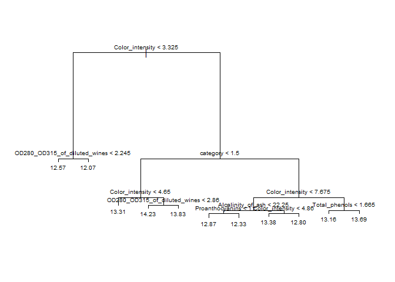

Fourth Blog Post
================

# Modeling

Out of all the methods we have learned, I found regression trees to be
the most interesting because they produce graphs that are easy to read.
In general, tree-based methods split the predictor space into regions
and then formulate predictions based on those regions. Regression trees
determine each split by using recursive binary splitting, an algorithm
that takes every possible value for each predictor, finds the residual
sum of squares (RSS), and minimizes the RSS based off the mean value for
each possible split it could do. Regression trees predict a continuous
response by using the mean of all the observations in a given predictor
space region.

I grabbed the wine data set from the [Machine Learning
Repository](https://archive.ics.uci.edu/ml/index.php) and made a
regression tree to see if I could predict the amount of alcohol in each
wine based on the variables given.

``` r
head(wine_data)
```

    ##   category Alcohol Malic_acid  Ash Alcalinity_of_ash Magnesium Total_phenols Flavanoids
    ## 1        1   13.20       1.78 2.14              11.2       100          2.65       2.76
    ## 2        1   13.16       2.36 2.67              18.6       101          2.80       3.24
    ## 3        1   14.37       1.95 2.50              16.8       113          3.85       3.49
    ## 4        1   13.24       2.59 2.87              21.0       118          2.80       2.69
    ## 5        1   14.20       1.76 2.45              15.2       112          3.27       3.39
    ## 6        1   14.39       1.87 2.45              14.6        96          2.50       2.52
    ##   Nonflavanoid_phenols Proanthocyanins Color_intensity  Hue OD280_OD315_of_diluted_wines Proline
    ## 1                 0.26            1.28            4.38 1.05                         3.40    1050
    ## 2                 0.30            2.81            5.68 1.03                         3.17    1185
    ## 3                 0.24            2.18            7.80 0.86                         3.45    1480
    ## 4                 0.39            1.82            4.32 1.04                         2.93     735
    ## 5                 0.34            1.97            6.75 1.05                         2.85    1450
    ## 6                 0.30            1.98            5.25 1.02                         3.58    1290

``` r
str(wine_data)
```

    ## 'data.frame':    177 obs. of  14 variables:
    ##  $ category                    : int  1 1 1 1 1 1 1 1 1 1 ...
    ##  $ Alcohol                     : num  13.2 13.2 14.4 13.2 14.2 ...
    ##  $ Malic_acid                  : num  1.78 2.36 1.95 2.59 1.76 1.87 2.15 1.64 1.35 2.16 ...
    ##  $ Ash                         : num  2.14 2.67 2.5 2.87 2.45 2.45 2.61 2.17 2.27 2.3 ...
    ##  $ Alcalinity_of_ash           : num  11.2 18.6 16.8 21 15.2 14.6 17.6 14 16 18 ...
    ##  $ Magnesium                   : int  100 101 113 118 112 96 121 97 98 105 ...
    ##  $ Total_phenols               : num  2.65 2.8 3.85 2.8 3.27 2.5 2.6 2.8 2.98 2.95 ...
    ##  $ Flavanoids                  : num  2.76 3.24 3.49 2.69 3.39 2.52 2.51 2.98 3.15 3.32 ...
    ##  $ Nonflavanoid_phenols        : num  0.26 0.3 0.24 0.39 0.34 0.3 0.31 0.29 0.22 0.22 ...
    ##  $ Proanthocyanins             : num  1.28 2.81 2.18 1.82 1.97 1.98 1.25 1.98 1.85 2.38 ...
    ##  $ Color_intensity             : num  4.38 5.68 7.8 4.32 6.75 5.25 5.05 5.2 7.22 5.75 ...
    ##  $ Hue                         : num  1.05 1.03 0.86 1.04 1.05 1.02 1.06 1.08 1.01 1.25 ...
    ##  $ OD280_OD315_of_diluted_wines: num  3.4 3.17 3.45 2.93 2.85 3.58 3.58 2.85 3.55 3.17 ...
    ##  $ Proline                     : int  1050 1185 1480 735 1450 1290 1295 1045 1045 1510 ...

According to the tree plot below, it looks like our first split takes
the “Color_intensity” and splits it into two groups: one group with
Color_intensity values \< 3.325 and another with Color_intensity values
\> 3.325.

``` r
set.seed(dim(wine_data)[1])
train <- sample(1:nrow(wine_data), size = nrow(wine_data)*0.8)
test <- dplyr::setdiff(1:nrow(wine_data), train)
wine_dataTrain <- wine_data[train, ]
wine_dataTest <- wine_data[test, ]
treeFit <- tree(Alcohol ~ ., data = wine_dataTrain)
plot(treeFit); text(treeFit, pretty = 0, cex = 0.6)
```

<!-- -->

``` r
#cross-validation:
#$dev is the cross-validation error (we want to minimize this)
cvTree <- cv.tree(treeFit); cvTree
```

    ## $size
    ##  [1] 11 10  9  8  7  5  4  3  2  1
    ## 
    ## $dev
    ##  [1] 62.58607 58.56485 58.56485 58.29328 57.66687 56.27490 52.47601 50.86769 67.63033 97.87939
    ## 
    ## $k
    ##  [1]      -Inf  1.024055  1.028840  1.129224  1.205961  1.537335  3.283298  5.305063 15.996943 43.790790
    ## 
    ## $method
    ## [1] "deviance"
    ## 
    ## attr(,"class")
    ## [1] "prune"         "tree.sequence"

``` r
#predict:
pred <- predict(treeFit, newdata = dplyr::select(wine_dataTest, -Alcohol))
#Calculate Root MSE
sqrt(mean((pred-wine_dataTest$Alcohol)^2))
```

    ## [1] 0.5307557
